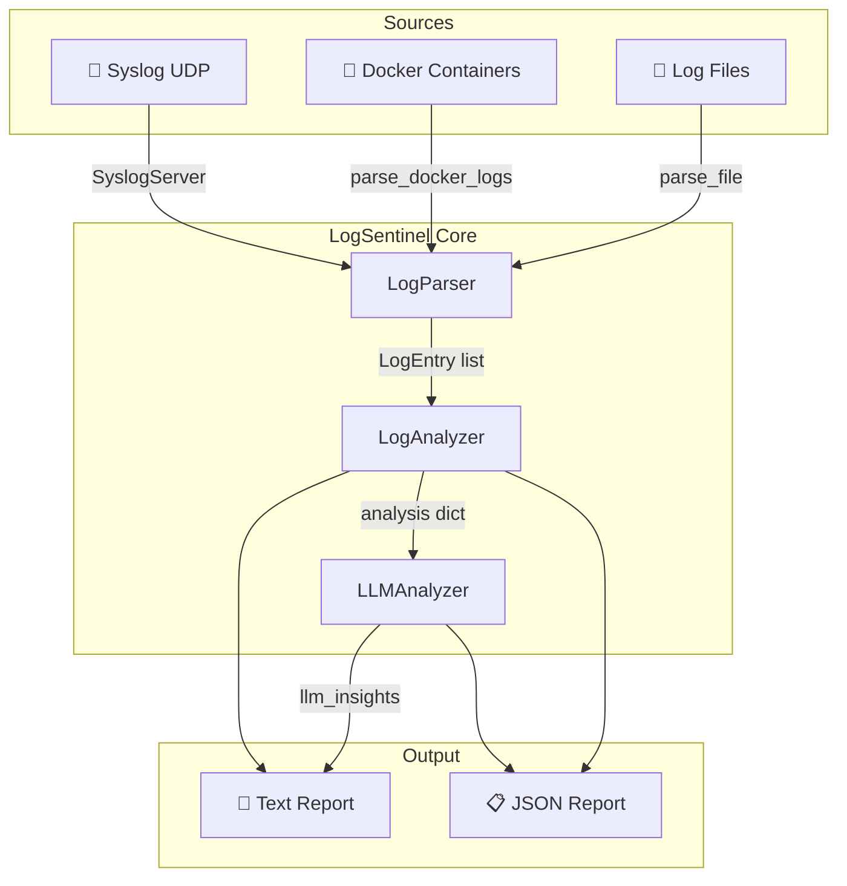
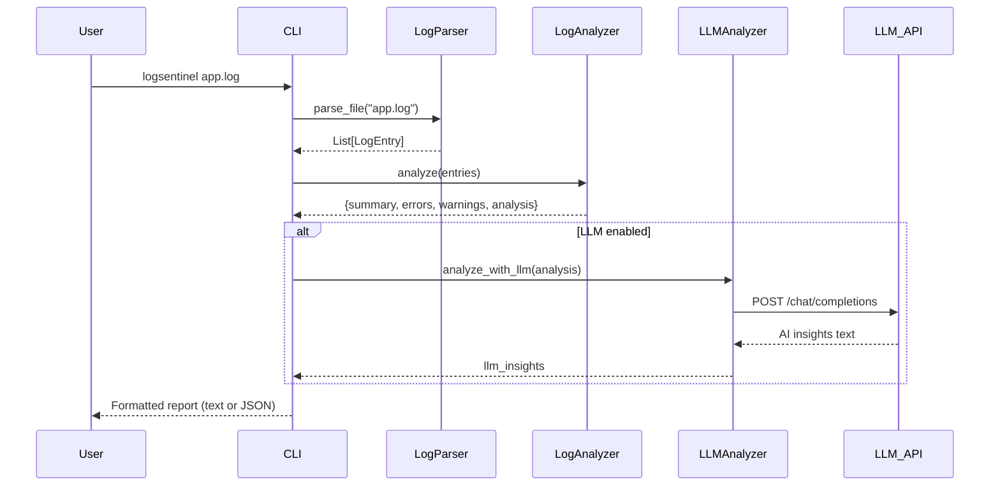
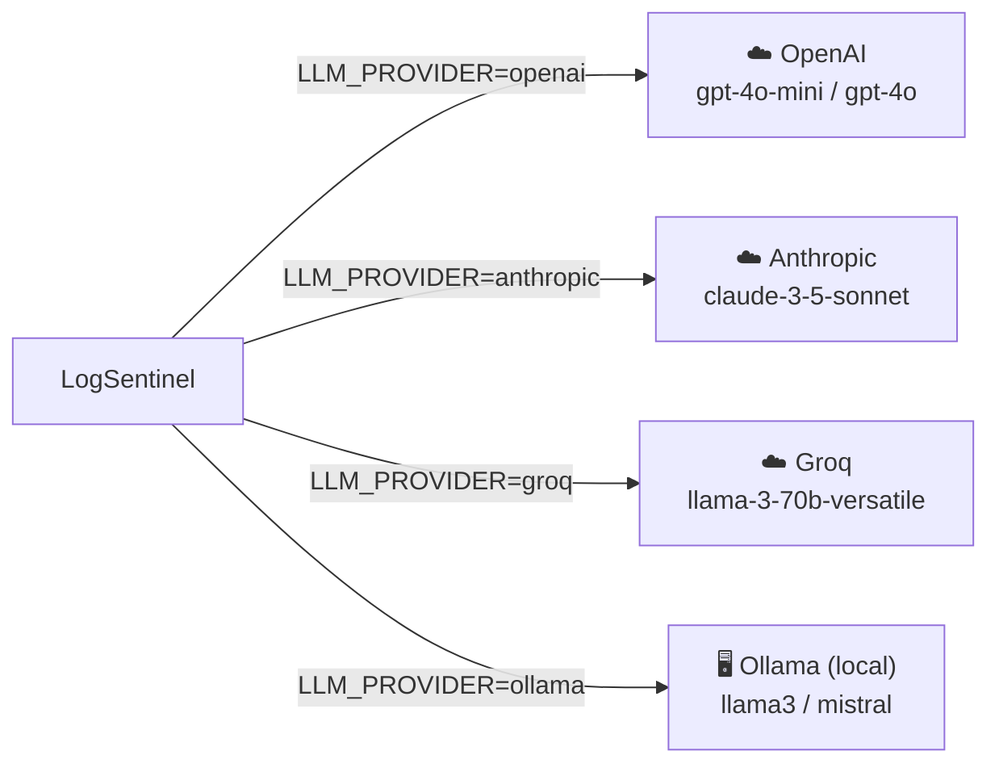

# 🛡️ LogSentinel

**AI-Powered Log Analyzer CLI** — detect anomalies, surface insights, and get actionable recommendations from your logs using Large Language Models.

[](https://www.python.org/downloads/)
[](LICENSE)
[](https://pypi.org/project/logsentinel/)

---

## Table of Contents

1. [Overview](#overview)
2. [Architecture](#architecture)
3. [Data Flow](#data-flow)
4. [Installation](#installation)
5. [Configuration](#configuration)
6. [Usage](#usage)
7. [CLI Options](#cli-options)
8. [Example Output](#example-output)
9. [LLM Providers](#llm-providers)
10. [Docker](#docker)
11. [Development](#development)
12. [Contributing](#contributing)
13. [License](#license)

---

## Overview

LogSentinel ingests logs from **files**, **Docker containers**, and **syslog** sources, runs a rule-based analysis pass, and optionally forwards a condensed summary to an LLM for root-cause analysis and remediation advice.

Key capabilities:

- 📂 Parse log files (standard, ISO-8601, and syslog formats)
- 🐳 Tail Docker container logs
- 📡 Receive logs via UDP syslog server
- 🔍 Classify entries by severity (DEBUG → CRITICAL)
- 📊 Detect error patterns and repeated messages
- 💡 Rule-based recommendations (memory, connection, permission issues)
- 🤖 LLM-powered root-cause analysis (OpenAI, Anthropic, Groq)
- 📄 Text and JSON output formats

---

## Architecture



---

## Data Flow



---

## Installation

### From PyPI

```bash
pip install logsentinel
```

### From Source

```bash
git clone https://github.com/dablon/logsentinel.git
cd logsentinel
pip install -e .
```

### With Dev Dependencies

```bash
pip install -e ".[all]"
```

### Docker

```bash
docker pull ghcr.io/dablon/logsentinel:latest
# or build locally
docker build -t logsentinel .
```

---

## Configuration

### Environment Variables

| Variable | Description | Default |
|---|---|---|
| `LLM_PROVIDER` | LLM provider to use | `openai` |
| `LLM_MODEL` | Model name | `gpt-4o-mini` |
| `OPENAI_API_KEY` | OpenAI API key | — |
| `ANTHROPIC_API_KEY` | Anthropic API key | — |
| `GROQ_API_KEY` | Groq API key | — |

```bash
export LLM_PROVIDER="openai"
export LLM_MODEL="gpt-4o-mini"
export OPENAI_API_KEY="sk-..."
```

### `config.yaml`

```yaml
# LLM Provider: openai, anthropic, groq, ollama
llm_provider: openai
llm_model: gpt-4o-mini

# Ollama (local, no API key needed)
ollama_url: http://localhost:11434
ollama_model: llama3

# Analysis Settings
max_errors: 50
max_warnings: 50
severity_threshold: WARNING

# Output Settings
default_format: text
verbose: false
```

---

## Usage

### Analyze a log file

```bash
logsentinel /var/log/syslog
```

### Analyze multiple files

```bash
logsentinel app.log error.log access.log
```

### Analyze a Docker container

```bash
logsentinel --container my-app
logsentinel --container my-app --lines 500
```

### Output as JSON

```bash
logsentinel app.log --output json
```

### Skip LLM analysis (fast, offline)

```bash
logsentinel app.log --no-llm
```

### Verbose mode

```bash
logsentinel app.log --verbose
```

### Version / Help

```bash
logsentinel --version
logsentinel --help
```

---

## CLI Options

| Option | Short | Type | Default | Description |
|---|---|---|---|---|
| `files` | — | `str…` | — | One or more log files to analyze |
| `--container` | `-c` | `str` | — | Docker container name/ID to tail |
| `--lines` | `-n` | `int` | `100` | Lines to fetch from Docker logs |
| `--output` | `-o` | `text\|json` | `text` | Output format |
| `--no-llm` | — | flag | off | Skip LLM analysis |
| `--verbose` | `-v` | flag | off | Show extra detail |
| `--version` | — | flag | — | Print version and exit |

---

## Example Output

### Text output (`logsentinel app.log`)

```
=== LogSentinel Analysis ===

📊 Summary:
   Total: 1,243
   Errors: 18
   Warnings: 47

🔴 Top Errors:
   [ERROR] Database connection refused at 10.0.0.5:5432
   [CRITICAL] Out of memory: kill process 4821 (python3)
   [ERROR] Permission denied: /var/data/cache/session.lock
   [ERROR] Connection timeout after 30s to api.example.com
   [ERROR] Unhandled exception in worker thread — see traceback

🟡 Top Warnings:
   Disk usage above 85% on /dev/sda1
   Retry attempt 3/5 for job ID 9f2a
   Slow query detected: 4,200 ms on table orders
   TLS certificate expires in 12 days
   Rate limit approaching: 950/1,000 requests used

💡 Recommendations:
   - Memory issues detected — check resource limits
   - Connection issues detected — check network/service availability
   - Permission errors detected — review access controls

🤖 LLM Insights:
   **Root Cause Analysis**
   The combination of an OOM kill and database connection errors suggests the
   service ran out of memory mid-transaction, leaving open connections that
   subsequently timed out.

   **Recommended Actions**
   1. Increase container memory limit or add swap space.
   2. Add a connection pool max-size guard (e.g. `max_overflow=5`).
   3. Rotate the session lock file after each crash restart.

   **Severity Assessment**: HIGH — immediate action required.
```

### JSON output (`logsentinel app.log --output json`)

```json
{
  "summary": {
    "total": 1243,
    "error": 18,
    "warning": 47,
    "info": 1150,
    "debug": 28,
    "critical": 1,
    "fatal": 0
  },
  "errors": [
    {
      "timestamp": "2026-03-04T10:42:01",
      "level": "ERROR",
      "source": "app.log",
      "message": "Database connection refused at 10.0.0.5:5432"
    }
  ],
  "warnings": [
    {
      "timestamp": "2026-03-04T10:41:55",
      "level": "WARNING",
      "source": "app.log",
      "message": "Disk usage above 85% on /dev/sda1"
    }
  ],
  "analysis": {
    "error_count": 18,
    "warning_count": 47,
    "error_patterns": [
      { "pattern": "Database connection refused", "count": 7 },
      { "pattern": "Connection timeout", "count": 4 }
    ],
    "warning_patterns": [],
    "recommendations": [
      "Memory issues detected — check resource limits",
      "Connection issues detected — check network/service availability"
    ]
  },
  "llm_insights": "**Root Cause Analysis** ..."
}
```

---

## LLM Providers

LogSentinel supports the following providers. Select one via `LLM_PROVIDER`:



| Provider | Env Var | Example Model |
|---|---|---|
| `openai` | `OPENAI_API_KEY` | `gpt-4o-mini` |
| `anthropic` | `ANTHROPIC_API_KEY` | `claude-3-5-sonnet-20241022` |
| `groq` | `GROQ_API_KEY` | `llama-3.3-70b-versatile` |
| `ollama` | — (local) | `llama3`, `mistral` |

### Switching provider

```bash
export LLM_PROVIDER=groq
export GROQ_API_KEY="gsk_..."
export LLM_MODEL="llama-3.3-70b-versatile"
logsentinel app.log
```

---

## Docker

### Run with a log file

```bash
docker run --rm \
  -e OPENAI_API_KEY="sk-..." \
  -v /var/log:/logs:ro \
  logsentinel /logs/syslog
```

### Run against a Docker container (requires socket mount)

```bash
docker run --rm \
  -e OPENAI_API_KEY="sk-..." \
  -v /var/run/docker.sock:/var/run/docker.sock:ro \
  logsentinel --container my-app --lines 200
```

### docker-compose

```bash
# Analyze logs
docker compose run --rm logsentinel /app/logs/app.log

# Run tests
docker compose run --rm test
```

---

## Development

```bash
# Clone and install
git clone https://github.com/dablon/logsentinel.git
cd logsentinel
pip install -e ".[all]"

# Run tests
pytest tests/ -v

# Run only unit tests
pytest tests/unit/ -v

# Run only e2e tests
pytest tests/e2e/ -v

# Build distribution
python setup.py sdist bdist_wheel
```

### Project Structure

```
logsentinel/
├── logsentinel.py        # Core: LogParser, LogAnalyzer, LLMAnalyzer, CLI
├── config.yaml           # Default configuration
├── setup.py              # Package metadata and entry points
├── requirements.txt      # Runtime dependencies
├── Dockerfile            # Container image
├── docker-compose.yml    # Local dev / test compose
└── tests/
    ├── unit/             # Unit tests (no external dependencies)
    │   ├── test_analyzer.py
    │   ├── test_collectors.py
    │   └── test_llm.py
    └── e2e/              # End-to-end flow tests
        └── test_flow.py
```

---

## Contributing

1. Fork the repository
2. Create a feature branch: `git checkout -b feat/my-feature`
3. Make your changes and add tests
4. Run the test suite: `pytest tests/ -v`
5. Open a Pull Request

---

## License

[MIT](LICENSE) © Blade
